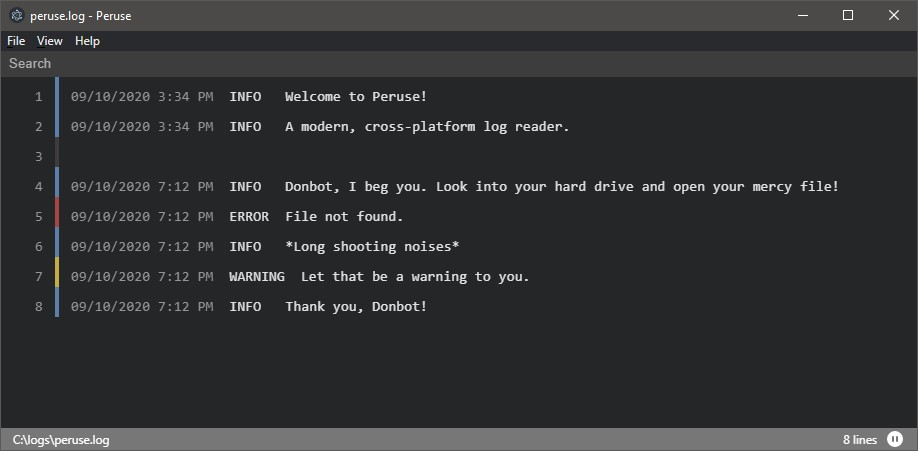

<h1 align="center">Peruse</h1>

✨ Does this log file spark joy? ✨

 

  Peruse through log files with ease in a modern, cross-platform environment. Peruse is a light-weight log reader designed with UX in mind.
  
  UI/UX inspired by [Visual Studio Code](https://github.com/Microsoft/vscode). Created with [Electron React Boilerplate](https://github.com/electron-react-boilerplate).

 

 

## Install

Coming Soon™.

## Docs

See the [docs and guides here](https://tom-oeste.gitbook.io/peruse/).

## Maintainers

- [Tom Oeste](https://github.com/tomoeste)

## License

MIT © [Tom Oeste](https://github.com/tomoeste)
